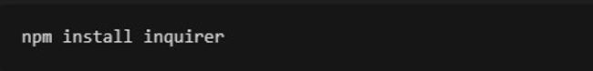
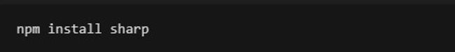
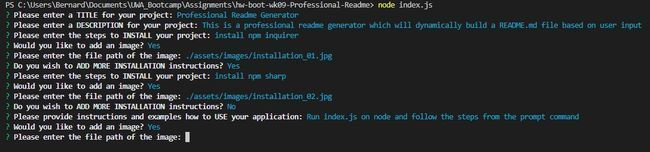

    
# Professional Readme Generator

    

    
## Description
This is a professional readme generator which will dynamically build a README.md file based on user input

## Table of Contents
- [Description](#description)
- [Installation](#installation)
- [Usage](#usage)
- [License](#license)
- [Credits](#credits)
- [Tests](#tests)
- [Questions](#questions)

    
## Installation
install npm inquirer     install npm sharp     

    
## Usage
Run index.js on node and follow the steps from the prompt command      
    
## License
Licensed under Apache 2.0

    
## Credit
John Smith - jsmith@readme.com  James Dean - jdean@hollywood.com  Donald Trump - dtrump@capitol.com  
    
## Tests
Functional testing: Test passed     Security testing: Security testing is a process intended to reveal flaws in the security mechanisms of an information system that protect data and maintain functionality as intended      
    
## Questions
[My gitHub](https://github.com/bernardjbs/)

Should you have additional questions, you can email me at bernarsjbs@readme.com and I will be glad to answer them

    