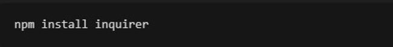
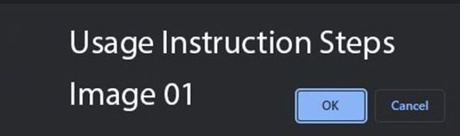

    
# A readme generator

    

    
## Description
This readme generator is cool and is pro!! 

## Table of Contents
- [Description](#description)
- [Installation](#installation)
- [Usage](#usage)
- [License](#license)
- [Credits](#credits)
- [Tests](#tests)

    
## Installation
step 1     Step 2    

    
## Usage
Usage 1      
    
## License
Licensed under BSD 2 Clause

    
## Credits
Bernard

## Tests
testing

    
## Questions
[My gitHub](https://github.com/bernardjbs/)

Should you have additional questions, you can email me at bernardjbs@yahoo.com and I will be glad to answer them

    