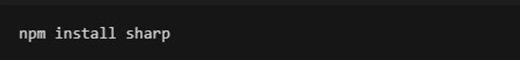
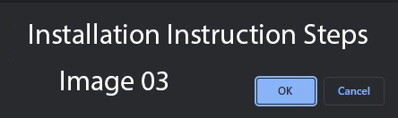

# Readme generator

## Description
this is a professional readme generator

## Table of Contents
- [Description](#description)
- [Installation](#installation)
- [Usage](#usage)
- [License](#license)
- [Credits](#credits)
- [Tests](#tests)
## Instructions
1      2      3      
## Usage
some usage instructions

## License
BSD-2-Clause

## Credits
bernard

## Tests
some testing

---

## Badges

