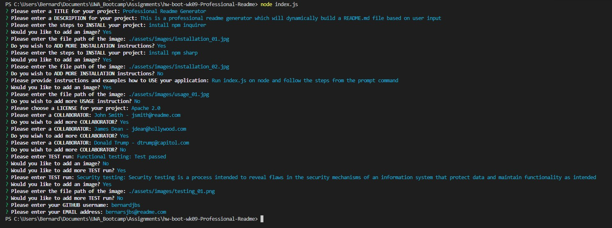

    
# Professional Readme Generator
    
## Description
This is a command line application that dynamically generates a professional readme file based on user input. 

## Installation
Packages to install: 
<br>Inquirer npm - Used for command line interaction and interface

```
npm install inquirer
```
Sharp npm - Used to resize images
```
npm install sharp
```

## Usage
To get started, run the index.js file in the terminal
```
node index.js
```
Then the follow the prompts accordingly: 
```
Please enter a TITLE for your project:
Please enter a DESCRIPTION for your project:
Please enter the steps to INSTALL your project:
```
After entering the installation instructions, choose if you want to add an image
```
Would you like to add an image? (Y/n)
```
If yes, enter the path for your image
```
Please enter the file path of the image: 
```
Then choose if you want to add another installation instruction
```
Do you wish to ADD MORE INSTALLATION instructions? (Y/n)
```
Enter Y to repeat and add another installation instruction <br/>
Enter N to continue to the next step, usage of application. 
```
 Please provide instructions and examples how to USE your application:
```
Choose if you want to add an image
```
Would you like to add an image? (Y/n)
```
Choose if you want to add more usage instructions
```
Do you wish to add more USAGE instruction? (Y/n)
```
From a list, choose which license is your application under
```
 Please choose a LICENSE for your project: (Use arrow keys)
 >MIT
  Apache 2.0
  GPL 3.0
  BSD 2 Clause
  BSD 3 Clause
  BSD 4 Clause
```
Enter the name and contact for collaborators
```
Please enter a COLLABORATOR:
```
Choose if you want to add more collaborators
```
Do you wiwh to add more COLLABORATOR? (Y/n)
```
Enter the tests done on the application
```
Please enter TEST run:
```
Choose if you want to add an image
```
Would you like to add an image? (Y/n) 
```
Choose if you want to add more testings
```
Would you like to add more TEST run? (Y/n)
```
Enter your github user name and email address to complete the Questions section
```
Please enter your GITHUB username:
Please enter your EMAIL address:
```

An example of the command prompt questionaire filled: 


## Link to deployment application
https://github.com/bernardjbs/hw-boot-wk09-Professional-Readme